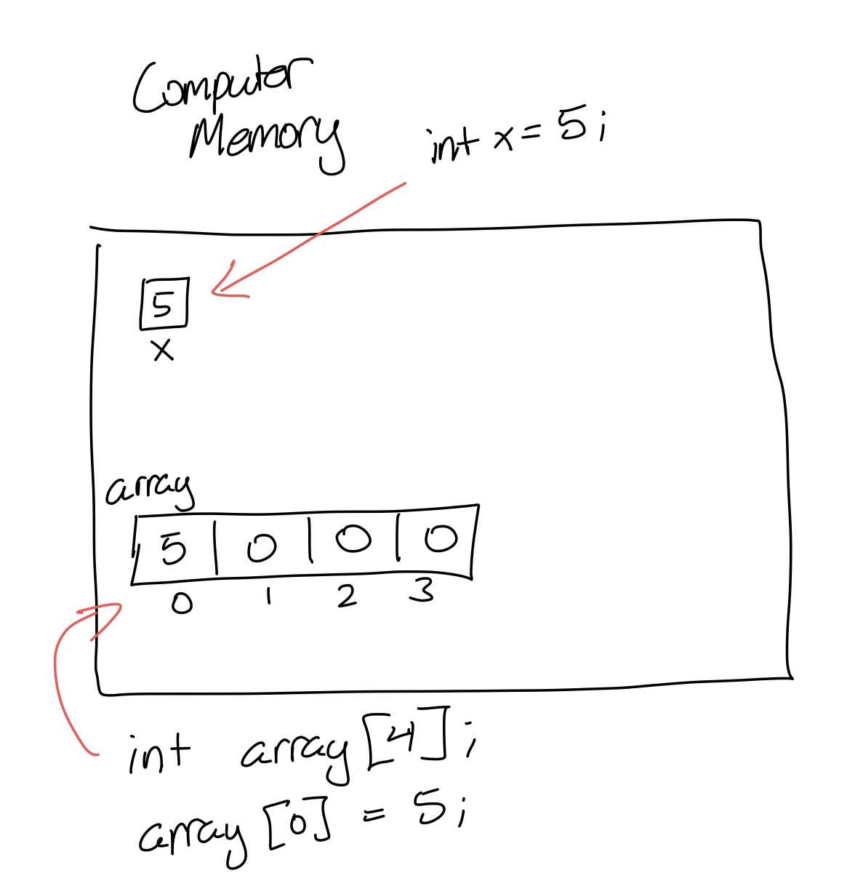

# Everything you need to know about Arrays

Arrays are the first data structure you will encounter in college and university when learning programming. These are incredibly useful tools and form the foundation for other data structures in Computer Science - Vectors, Hash Tables, Linked Lists. Don't worry about these other data structures - we'll cover them soon!

## What is an array?

An array is defined in most textbooks as a "contiguous block of memory". Essentially you can think of an array as a container of variables located next to each other in Computer Memory.

 <!-- Drawing of computer memory in #pastebin-->

As you can see in the above image, when we declare a variable, a certain amount of space is allocated in computer memory. "X", which contains 5, is a int variable. "array" is an array of integers and has 4 spaces or **indices**. Each index can be thought of as it's own variable equivalent similar to "X"

## How do we create an array?

The syntax for creating an array is similar to that of a variable:

```
    data_type name[size];
```

- `data_type`s refer to what is stored in the array. Can be any type

- `name` is the name of the array/container.

- `size` goes inside the brackets (`[]`) and sets how large the array is. In other words, how many of a `data_type` to store.

For example: 

```c++
    int array[4]; 
```

This creates a collection of 4 integer "variables".

Each index of the array can be accessed using the `[]` operator like so:

```c++
    array[0] = 5; //sets first index to 0
```

_Note: You count indices in an array from 0, not 1. The first index is index 0 and the second index is index 1 (and so on). Not confusing at all!_

You can `cout` the value of a particular index of an array, or print all the values in an array using a loop:

```c++
    //One particular value:
    std::cout << array[0] << std::endl;

    //All values using a for loop:
    for(int i = 0; i < 4; i++){
        std::cout << array[i] << std::endl;
    }
```

I want to emphasize the idea that each index is essentially just a variable.


### What's so useful about arrays?

Arrays are a way for programmers to work with lots of data at a time (assuming of the same type). 

Let's say that you want to store 100 phone numbers. Instead of creating 100 variables to use, and then keeping track of each phone number variable, you can use an array like so: `int phoneNumbers[100];`

## A deeper dive into arrays

_Note: This section will touch on pointers and memory addresses. It is recommended that you read about pointers<!--[pointers](Pointers.md)-->._

### Arrays are just pointers

If you remember, a pointer stores a memory address. An array is a block of contiguous memory, which has an address.

Try running this example to see what happens.

```c++
    int main(){
        int array[4];
        std::cout << array << std::endl;

        return 0;
    }
```

the output should be some memory address of that array like `0x7fff4d1b82e0`. Yours is probably a different address than mine.

So when we access the first index of an array, we are derefencing the pointer. `array[0]` is equivalent to `*array`. To access other indices, we offset the address by however many we need to get to the desired index. Remember what I said about arrays being a block of **contiguous** memory? Here's where this is relevant:

```c++
    int array[4];

    std::cout << *(array + 2) << std::endl;
```

In the above code snippet, we are dereferencing the memory address of `array + 2`. What exactly is `array + 2`? Well we know that `array` is a memory address (as seen earlier). What is `2`? 

`2` is implicitly treated as an integer by the compiler. An integer to a compiler has 4 bytes, so when we add two integers to a memory address, we're offsetting the address by 4 bytes. So 0x7fff4d1b82e0 + 2 (4 bytes) would be the memory address: `0x7fff4d1b82e4`. That is the address of index 2 in the array (`array[2]`).

You can verify this yourself by running the following code:

```c++
    int main(){
        int array[4];
        for(int i = 0; i < 4; i++){
            array[i] = i; //fill the array with data
        }

        std::cout << "pointer method: " << *(array+2) << std::endl;
        std::cout << "bracket method: " << array[2] << std::endl;

        //also to verify the size of an integer:
        std::cout << "size of \"2\" integers: " << sizeof(2) << " bytes" << std::endl; 

        return 0;
    }

```

### dynamically allocated arrays

A notable characteristic of arrays is that they are `static` in size. Once you set a size, it doesn't change. This is a pretty significant limitation of arrays, because what if we want to grow our collection and we don't necessarily know how big it'll be - such as when reading data from files.

A `vector` ([`std::vector`](https://cplusplus.com/reference/vector/vector/)) is known as a "resizeable" array because it can grow and shrink with the `push_back()` and `pop_back()` methods respectively.

The way a vector is implemented is by using a dynamically allocated array. Dynamically allocated means what it sounds like! They are arrays that change size by being reallocated.

I'll demonstrate an example - copy and paste this into your IDE and see what happens:

```c++
    int main(){
        int* p_array = new int[4]; //dynamically allocated array

        for(int i = 0; i < 4; i++){ //fill some data
            p_array[i] = i;
        }

        for(int i = 0; i < 4; i++){
            std::cout << p_array[i] << std::endl;
        }

        std::cout << "freeing" << std::endl;
        delete [] p_array; //we must free up the memory before we reallocate
        std::cout << "done freeing" << std::endl;

        p_array = new int[5]; //reallocate with more space

        for(int i = 0; i < 5; i++){
            p_array[i] = i;
        }

        for(int i = 0; i < 5; i++){
            std::cout << p_array[i] << std::endl;
        }

        delete [] p_array; //free up again to avoid memory leaks
    }
```

To allocate our array on the heap, we are using the `new` keyword. This allows us to manually free up that memory (using `delete`) and reallocate with our new size. 

This is fundamentally how vectors work!


---
# [Go back to the home page](../home.md)