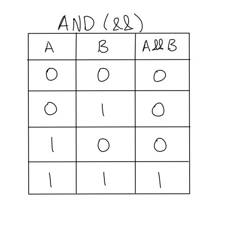
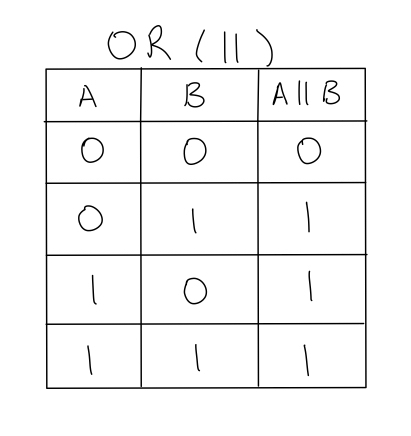
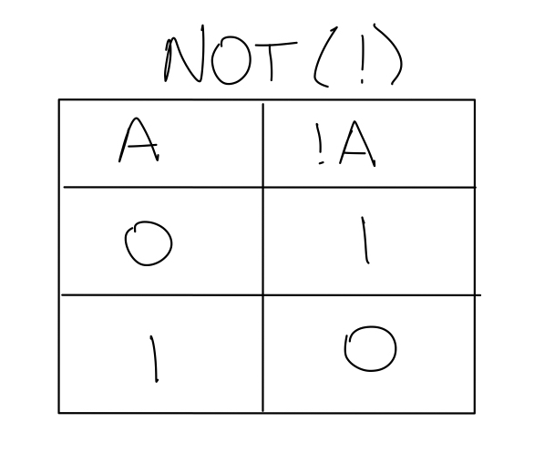

# Booleans, Logic and Control Flow Statements

## What are booleans?

We have talked about some variables like ints, floats/doubles,
chars, and strings which store values like numbers, and letters/words.

Booleans are a little bit different because they only have two possible
values: 1 or 0 (true or false). We create boolean variables just like how we
create variables of other types:

```c++
bool value = false; //declare a boolean variable and initialize it to false
```

---

`True` and `False` have numerical versions as well by the way. If you `cout` value,
the value shown on screen might be `0` not `False` as you might expect. But if value is set
to true, you'll see a `1` on the screen.

The compiler by default treats 0 as `False` and any number greater than 0 as `True`. This
also means you could set value to true by assigning it a value like:

```c++
value = 50;
```

_I challenge you to test this out in your code and see what happens when you cout value._

### So what?

As we explored above, we can store booleans as variables, but that's not the only thing
we can do with booleans.

In C++ (and other languages) we have `relational operators` which can compare two values
(either variables and/or literals - which we've talked about before [here](./Variables.md)).

For example, if we have two ints:

```c++
int x = 5;
int y = 10;
```

## Relational Operators

We can evaluate if one is greater than the other, or if they are equal to each other using
the following relational operators:

---

- `>` - Greater Than
- `<` - Less Than
- `>=` - Greater Than or Equal to
- `<=` - Less Than or Equal to
- `==` - Equal to (not to be confused with the assignment operator `=`)
- `!=` - Not Equal to

---

Each of these operators gives its result in a binary (boolean) format. Either `True` or `False`
So how do we evaluate using these relational operators?

With `x` and `y` defined above, and our relational operators list as reference, try and answer
the following questions:
---
_Answer whether or not the following statements are `True` or `False`_:
```
x > y               - Is x greater than y
x < y               - Is x less than y
x >= y              - Is x greater than or equal to y
x <= y              - Is x less than or equal to y
x == y              - Is x equal to y
x != y              - Is x not equal to y
```

To obtain the answers, verify these expressions using `If` Statements covered below.

---

## Welcome to If Statements

`If` statements are the first foray into logic in coding. Our program gets significantly "smarter"
because it gets to make decisions and change its behavior depending on other factors.

They are generally pretty intuitive. An example could be "**If** you are a person, then do
action". Notice that the first part of my example can be broken down as such:

```
If you are a person, then do action
    (boolean value)          (action)
```
Following the if, there is a boolean value being evaluated. To the computer, either you are
a person, or you aren't. There's no in between. it operates as `true` or `false` (hence boolean)

The syntax for `if statements` looks like this:

```c++
if(/*CONDITION*/){
    //do something
} else {
    //do something else
}
```
You would put whatever condition you want to evaluate in the parenthesis `(` `)` of the if 
statement. Afterwards, you would put the action inside the `if` block, between the opening
curly brace and the ending curly brace (`{``}`). 

For example, if you want to verify your answers to the practice above you could 
make a program like the following:

```c++
if(x > y){
    std::cout << "X is greater than Y" << std::endl;
} else {
    std::cout << "X is not greater than Y" << std::endl;
}
```

You may have noticed that I have this `else` as part of my if statement. Else just means
the opposite of the condition that I am checking for. If my condition evaluates to false,
then the code in the if block then it executes the code within the `else` block.

---

## Truth Tables and Conditional operators

If we want to evaluate multiple conditions at the same time, we need to discuss truth tables.

There are a bunch of conditional operations and we'll have a section dedicated to exploring
them later on. But for now lets talk about the `&&` (`AND`) and `||` (`OR`) operators.

In C++ you can add two or more conditions by joining them together like so:

**AND**

```c++
if(/*Condition 1*/ && /*Condition 2*/){
    
}
```

**OR**

```c++
if(/*Condition 1*/ || /*Condition 2*/){
    
}
```

`&&`/`AND` means that all the sub-conditions have to be true in order for the condition to
evaluate true.

`||`/`OR` means that only one of the sub-conditions have to be true in order for the whole
condition to evaluate as true

We can explore this in a Truth Table:




In an `AND` operation, both A and B have to be 1 (`True`) to result in a 1 (All subconditions must
be true in order for the whole condition to be true). However, in the `OR` operation, the
only case where the whole condition is false, is when both subconditions A and B are both 0
(or `False`)

This is a more mathematical way of thinking about it, and it'll come up later when we discuss
other `bitwise` operators.

### The Not Operator

The very last thing I want to mention is the `!`/`Not` operator. We saw this with the `!=`
to mean "not equal to" when comparing two values. Essentially all it means is that we invert
the value of the boolean.

If we have a boolean like so:

```c++
bool value = false;

if(!value) { //the code below will only execute when value is "not false" aka "true"
    //do something
}
```

The `!` operator also works with assignment - You can assign the `!` of a boolean
variable.



Take a look at the following code and predict what the output is:

```c++
bool value = false;
if(!value){
    std::cout << "True" << std::endl;
    value = !value;
} else {
    std::cout << "False" << std::endl;
    value = !value;
}
if(!value){
    std::cout << "True" << std::endl;
    value = !value;
} else {
    std::cout << "False" << std::endl;
    value = !value;
}
```

Go ahead and take a guess at the output, then try running the code yourself.
Were you right? As an exercise, comment out each line of the program given above.


---
# [Go back to the home page](../Home.md)