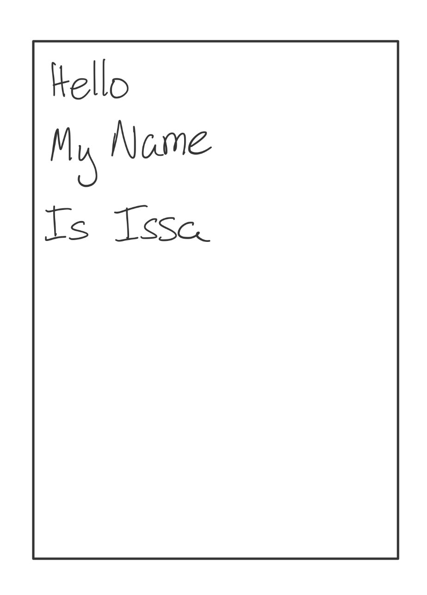
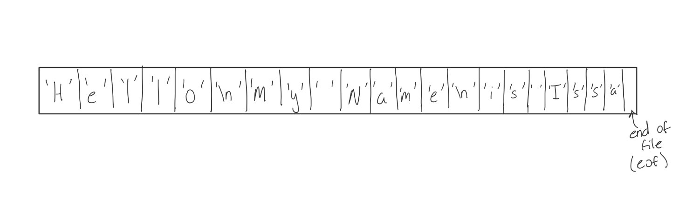
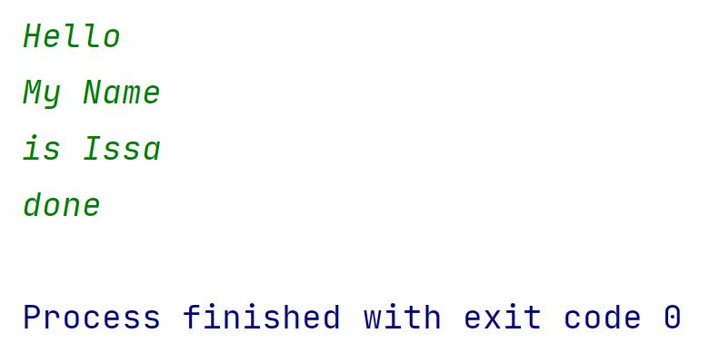

# Loops, Files and Reading/Writing in C++

When we covered [Input and Output in C++](./InputOutput.md), we allowed the user to enter data directly into the program through the terminal. Sometimes rather than taking in input from the user directly, we can pull data from a file or database. 

## The importance of looping with files

I strongly encourage that you read about loops before continuing on with files. Looping - specifically with `while` loops are integral to reading files. I will briefly cover looping as it pertains to files, but for a more comprehensive explaination of how looping works, you should really checkout my notes on loops [here](./Loops.md)


## Why do we care about working with files?

When programs run, they run in a part of the computer called RAM (Random Access Memory). When we work with variables and perform calculations, those operations and variables are located in memory. When the computer is turned off, that memory is wiped and all data will be lost. Using files means that the data you're working with can persist between reboots.

Files are stored on the disk - hard drives/SSD (solid state drives). Read more about [hard drives](https://en.wikipedia.org/wiki/Hard_disk_drive) and [SSDs](https://en.wikipedia.org/wiki/Solid-state_drive) for more information about the differences between them. When I say "disk", I am using that word to mean either SSD or Hard Drives since they're treated virtually the same in C++.

## Getting started

To begin, we will need some way to work with a file in C++.

The very first thing you'll need to do is `#include <fstream>`. "fstream" stands for "**f**ile**stream**". (recall that we briefly discussed "streams" in the section on [Input and Output](./InputOutput.md)). `fstream` will allow us to create variables that represent the files we want to interface with. Think of these variables as a stand-in for the actual file itself.

There are three types of file variables in `fstream`:

- `std::ifstream` or input filestream: This variable will allow you to input data from the file and load it into the program

- `std::ofstream` or output filestream: This will do the opposite, and write out data from the program to a file.

- `std::fstream` : Using this variable will allow you to both read from and write to files.

### So what do we do with our file variable?

As stated earlier, the file variable is our way of linking a file to use within our C++ program. For simplicity, we'll work with a text file - you can use whatever file types you want (or create your own).

_Note: This is where programs like Microsoft Word or Adobe Photoshop get to create their own file extensions - `.doc`, `.psd` etc. You'll be able to create your own as well by the end of this.

The very first thing to do is open the file you want to work on. If the file already exists, the `open` function will find it and use it. If it doesn't exist, it'll be created. From our perspective, the process of reading and writing to a file at this stage is identical.

Lets go ahead and test out some sample code:

`Sample.txt`

```
Hello
My Name
is Issa
```

`main.cpp`

```c++
int main(){
  std::ifstream file; //note that I am using ifstream

  file.open("Sample.txt");

  if(file.fail()){
    std::cout << "Error opening file" << std::endl;
    exit(999);
  }

  return 0;
}
```

With the above snippet of code, we are assuming that the `Sample.txt` and `main.cpp` files are located in the same directory (folder). There is a block of code to check that the file was successfully opened - `fail()` should always be used after opening a file to safeguard us from attempting to work with an invalid file variable.

### What do text files actually look like?



This is how the computer presents a text file to us. However, under the hood, the computer treats files like super long arrays of characters:



Spaces (`' '`) and newlines (`'\n'`) are counted as characters in this array of characters and at the very end there's an `end of file` (eof) bit that marks the end of the file!

It is important to understand how files actually work so we can read them into our program.

### Reading a file

In the above snippet, I made my file variable an `ifstream` variable. The first thing I want to demonstrate is reading an already existing file into a program:

`main.cpp` continued:

```c++
//  ...

  std::string temp = "";
  while(!file.eof()){
    std::getline(file, temp);
    std::cout << temp << std::endl;
  }

  return 0;
}
```

_Go ahead and run this code yourself_

The while loop I have written uses the `end of file` bit I mentioned above. We will keep looping until we encounter that `eof` bit which tells us there is no more text in the file.

All we've done in this program is print out exactly what was in the file, into the terminal. Very straightforward example of how to read a file in C++

### Getline with files

While you can use the `>>` streaming operator to pull in data from a file (much like we did with [user input](InputOutput.md)), `std::getline` is a much more straightforward and customizable way to read data from a file.

I highly encourage you all to read the documentation for [`std::getline`](https://cplusplus.com/reference/string/string/getline/).

`std::getline` has three parameters.

- source - a stream to pull data from (can be user input, file input etc.)
- destination - a std::string to store that data intermediarily
- delimiter - to what character. defaults to `'\n'` (newline)


If you don't enter anything for the third parameter, like I did above, getline will get the entire line (up until the `'\n'`) - hence the name `std::getline`. But you can be more specific and break up the words by spaces or commas by changing the delimiter.

### Writing to a file

Writing to a file is pretty straightforward once you understand how files work under the hood.

Let's use user input to write to a file using getline.

`main.cpp`

```c++
int main(){
  std::ofstream file; //note I am using ofstream
  std::string input;

  file.open("output.txt");
  if(file.fail()){
    std::cout << "Error opening file" << std::endl;
    exit(999);
  }

  while(std::getline(std::cin, input)){
    if(input == "done"){
      break;
    }
    
    file << input;
  }

  return 0;
}


```

_Note: we use streaming operators to send data to the file just like we do for cin (>>) and cout (<<)._

After running the program we get an `output.txt` file that contains whatever you inputted in the terminal.

Notice that simply pressing the enter key doesn't create a new line. If you want a new line, you'll have to write the `'\n'` in the terminal. I tried to recreate my `Sample.txt` file from above by writing to the terminal like so



However my `output.txt` looks like this:

```
HelloMy Nameis Issa
```

In order to fix this, I need to add `'\n'` to the string:

```
Hello\nMy Name\nis Issa
done
```

---
# [Go back to the home page](../home.md)
