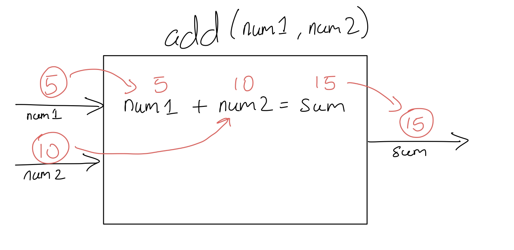

# Functions in C++

The most common thing you'll encounter in Coding - in any language - is the usage
of functions. Functions allow us to break up our code and make it modular. A lot more
code than you might expect, is reusable.

## What are functions?

Functions are pieces of code that can be `called` from elsewhere in the code. A block
of code can be written and reused multiple times without typing that block of code each
time.

### General Structure of a function:

```
Return_Type Name(Arguments/Parameters){
    //code inside
}
```

Lets break down what's happening above:

- `Return Type` refers to the value returned by the function. You need to tell the
compiler what value you're expecting to return. (We'll go in more detail soon)


- `Name` is pretty self explanatory, it is the name of the function. We will use this 
name to call the function elsewhere in the code.


- `Arguments/Parameters` are optional values/variables that are sent to the function. 
Not all functions have arguments.

## Arguments/Parameters

Arguments and Parameters can be thought of as the input for a function. We need to
supply the compiler with information about what the function will receive when it is
called - hence the parameters.

If we have a function that adds two numbers together, our inputs would be the two
numbers. In other words, we would need to tell the compiler to accept two `int`s or
two `float`s/`double`s, or any combination of those.

Generally, any data type (such as those explored in [Variables](./Variables.md) can be
passed as a parameter).

_There is technically a difference between parameters and arguments; Parameters refer
to the variables in between the `()` that tell the compiler to expect input. Arguments are
the actual values passed when you call the function._

## Return and Return Types

Just as we can visualize the parameters as the **inputs** of a function, we can also
treat the `return` value as the **output**.

The compiler needs to know what value the function will return, just as it needs to
know what parameters the functions will take. Together these form the _function signature_.

You can use pretty much any data type as the return type. Some common return types are:

- `bool` - generally to verify if a function was called and executed correctly
- `string`/`int`/`double`/`float` - return a some sort of value
- `void` - return nothing, generally used to run code more easily.

Unfortunately, We can only return one thing from a function. There is a way to get around
this limitation however through classes which we will cover soon!

### Visual Abstraction of a Function

Rather than imagining functions as blocks of code, lets abstract them as machines 
that perform actions (and the details for how they perform the actions don't matter)



### Example: Addition function

**Premise: We are creating a math library and the first function we've decided to create
is an addition function. It takes two integers and adds them together. Finally, it returns
the sum as an integer.**

**Critical Thinking:** What information can we extrapolate from the premise? What are our
parameters? What is our function's objective? What is our return type - do we have one?

```c++
int add(int num1, int num2){ //new function that takes in two ints as arguments and returns an int
    int sum = 0; //declare and initialize an int to hold the sum of the two numbers passed as arguments
    sum = num1 + num2; //add the two numbers together and store in sum
    return sum; //return sum
}
```

Cool right? We have a function... But we haven't quite discussed how to use it.

## Calling and using functions

When we call a function, we tell the compiler to execute the code inside that function.
We can send information to the function (through parameters/arguments), and we can catch
any output returned by the function in variables:

Using the `add` function defined above, lets add some numbers together:

```c++
int main() { 
    int x = 5;
    int y = 10; 
    
    int answer = add(x, y); 
                            
    
    
    std::cout << "The sum of 5 and 10 is: " << answer << std::endl;
    
    //We can also pass values directly to the function:
    answer = add(20, 150);
    
    std::cout << "The sum of 20 and 150 is: " << answer << std::endl;
    
    return 0; 
}
```

Some stuff to note:

- We are in our main function. Every program has one. This is considered to be the entry point of our application

- The name of the variables do not have to match the ones in parameters. If they do, that is fine because they exist in different "scopes" (talk more about this later)

- we call the function by writing it's name with the () afterwards, and we store the return value in answer. In a function that has no paramters, we would still provide () to mark that it is still a function

- The main function returns something at the end (0 in this case is convention for program ran fine).

## Some more details about how functions work

When we pass arguments to a function, the values sent to the function get copied to the
variables inside the parameters. In the above add function, 5 and 20 were copied to the
variable `num1` while 10 and 150 were copied to the variable `num2`.

As we illustrated above:


The variables inside the add function; `num1`, `num2`, and `sum` are all deleted when
the compiler reaches the end of the function. We also cannot access the variables from
outside of the function.

## Scope

Scope refers to a region of code where variables and code exist. When you program 
inside the curly braces ({}) of the main function, you are said to be in the main scope.
When you program inside the add() function's {}, you are in the add function's scope.

If you make a variable that isn't contained in any {}, you are said to be in the global
scope.

```c++
//outside main scope (called global scope)
int main(){
    //inside the main scope
}
```

### So what? Why does scope matter?

Understanding that our variables are local to the scope they live in is fundamental for
understanding functions. And that is part of the reason why we have `return`.

### Challenge Problem:

**Premise: You are tired of typing out `std::cout << "some text here" << std::endl` every
time you want to print something to the screen. You decide to create a function that 
takes a string as an argument and prints that string to the screen. Your function 
doesn't return anything.** 

**Critical Thinking:** What information can we extrapolate from the premise? What are our
parameters? What is our function's objective? What is our return type - do we have one?

Go ahead and implement this function yourself. Also try calling it from main
when you are done to verify that you've done this correctly.

----

# [Go back to the home page](../home.md)