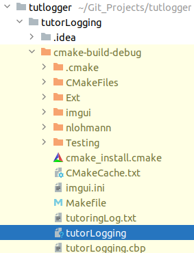

# How CMake works

## Configuration Stage

CMake creates an empty build tree and collects details about the environment it's working in. 

`CMakeLists.txt` file is parsed and executed - This file tells CMake about the project structure, targets and dependencies (libraries and other CMake packages)

`CMakeCache.txt` file is created to store variables - like paths to compilers and other tools

## Generation Stage

CMake will build a build system - usually a Makefile. This is the general idea of how my preferred IDE (Clion) works. - As you can see below:

## Building Stage

Build tools will invoke the compiler, linker and other tools to build your application

# CMake in the Command Line

## 5 executables in CL

- cmake: main executable
- ctest: test driver program to run and report test results
- cpack: used to generate installers and source packages
- cmake-gui: graphcial wrapper around cmake
- ccmake: console gui wrapper around cmake

# File Syntax

## CMakeLists.txt

Required at least one in root of source tree and must contain at least two commands:

- `cmake_minimum_required(VERSION <x.xx>)` - sets version of cmake to use
- `project(<name> <options>)` - names the project and lets us configure it (optionally)

Can also organize project so that each subdirectory has it's own CMakeList.txt file. Can add `add_subdirectory(api)` to add another CMakeLists.txt file in `api` to the root CMakeLists.txt file. 

Doing so allows for cleaner file structures and breaks up the project into smaller units that are easier to work with.

## CMakeCache.txt

There are two sections. EXTERNAL cache entries are ok for users (us) to modify. INTERNAL cache entries are automatically generated by CMake and not recommended for us to modify.

# Macros in CMake

- ${sourceDir} - path to the source tree
- ${sourceParentDir} - path to the source tree's parent directory
- ${sourceDirName} - name of file in ${sourceDir} path
- $env{<variable-name>} - variable macro

